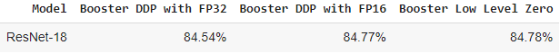

# resnet-fine-tuning-and-experiments-with-ColossalAI
Wang Shining's CS5246 A6 repo (resnet experiments with ColossalAI on CIFAR10)

## Overview
In this assignment, we train and evaluate ResNet-18 against CIFAR10 dataset with ColossalAI. A full example with running logs and experiment results can be found in A6.ipynb. Below is a quick overview of the reproduced performance result.

## Changes made to the [original example](https://github.com/hpcaitech/ColossalAI/tree/main/examples/images/resnet)
- Training batch size (original - 100, new - 128)
- Evaluation batch size (original - 128, new - 256, to speed up evaluation process)
- Number of GPUs (original - 2, new - 1, due to Google Colab GPU constraint)

## How to run this repo
The experiment was done using Google Colab due to [prerequisites of Colossal AI](https://colossalai.org/docs/get_started/installation). Hence we will need google drive and google colab to run the code. Here's a step by step guide.
- Clone repo from https://github.com/sh1ningwang/resnet-fine-tuning-and-experiments-with-ColossalAI.git
- Create a Google Drive folder with name 'CS5260_A6' for example, and copy paste the following items from the cloned repo
  - eval.py
  - train.py
  - requirements.txt
- Create an empty folder named 'model' within the Google Drive folder. This is for saving our model during training. Hence, you will have the following structure:
  - Your_Google_Drive_Folder
    - model
    - eval.py
    - train.py
    - requirements.txt
- Create a new Google Colab notebook and upload A6.ipynb which can be found in the cloned repo.
- Run cells sequentially.
  - You need to give Colab permission to access your Google Drive.
  - You can safely ignore the pip install errors below:
    - ipython 7.34.0 requires jedi>=0.16, which is not installed. 
    - moviepy 1.0.3 requires decorator<5.0,>=4.0.2, but you have decorator 5.1.1 which is incompatible.
  - Note that in cell 'path and scripts definition', you need to change the variable 'resnet_experiment_root_path' accordingly with respect to the folder you have created in the Google Drive. For example, if your created folder 'A6_Folder' is located under the root of your Google Drive, you need to change the value to '/content/drive/MyDrive/A6_Folder'.
  - The training time may vary depending on the GPU compute capability. In my case, the training cell takes around 2h to finish with A100.
- Once the last cell 'Evaluation and reproduce performance table' completes, you will get a performance table which can be compared with the original example result [here](https://github.com/hpcaitech/ColossalAI/tree/main/examples/images/resnet)
